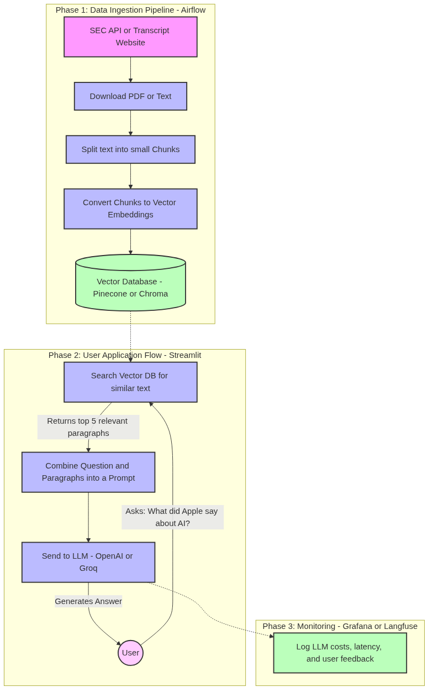

# Sec Edgar RAG Chatbot
A chatbot that downloads SEC 10-K financial filings, parses the raw HTML, embeds the data into a ChromaDB vector store, and allows users to query the data via a Streamlit RAG interface. 

The architecture is fully orchestrated by Apache Airflow, utilizes LLM-as-a-Judge mechanisms for real-time evaluation, and streams telemetry into a centralized PostgreSQL database.

<div align="center">
  
</div>

## ✨ Features

- **Automated Data Pipeline:** Apache Airflow automates the ingestion, parsing, chunking, and embedding of SEC 10-K filings.
- **Hybrid Search Retrieval:** Combines Dense Vector Search (ChromaDB) with Sparse Keyword Search (TF-IDF).
- **Document Re-Ranking:** Uses a state-of-the-art HuggingFace Cross-Encoder to prioritize the most relevant semantic chunks.
- **Dual-Agent LLM Generation:** A Drafter LLM creates the initial answer, while an Auditor LLM strictly fact-checks the response against the retrieved context to prevent financial hallucinations.
- **Centralized Telemetry:** Streams user feedback, query latency, and automated LLM-as-a-judge hit-rate metrics directly into a PostgreSQL database.
- **Streamlit Web UI & Dashboard:** Real-time chat interface with built-in pipeline triggering, data purging (Delete Ticker), and a 6-chart MLOps dashboard.

## 🏗️ Architecture Stack

- **Orchestration:** Apache Airflow
- **Frontend & Dashboard:** Streamlit
- **Database (Telemetry):** PostgreSQL
- **Vector Database:** ChromaDB
- **LLM Routing:** OpenRouter API (Fallback supported)
- **Embeddings / Re-ranking:** HuggingFace `sentence-transformers`, `ms-marco`
- **Deployment:** Docker & Docker Compose

!(rag_architecture)[img/rag_architecture.png]

## 🚀 Quick Start

> [!IMPORTANT]  
> You must have Docker and Docker Compose installed on your machine. You will also need an API key from [OpenRouter](https://openrouter.ai/).

### 1. Environment Setup

Copy the `.env.example` file to create your local `.env` configuration file:

```bash
cp .env.example .env
```

Open the `.env` file and populate it with your API keys and configuration:
```properties
OPENROUTER_API_KEY=your_openrouter_key
EMAIL=your_email@example.com
COMPANY=YourCompanyName
# Airflow UID is typically set to 50000 by default, or your local user ID
AIRFLOW_UID=50000
```

> [!NOTE]  
> The `EMAIL` and `COMPANY` environment variables are strictly required by the SEC Edgar API to identify who is downloading their data.

### 2. Build and Launch the Cluster

Start the entire multi-container architecture (Airflow Scheduler, Webserver, PostgreSQL, Streamlit, and ChromaDB):

```bash
docker compose up -d --build
```

### 3. Initialize the Pipeline

You can trigger the pipeline entirely from the Streamlit UI without touching Airflow!

1. Navigate to the Streamlit UI at **http://localhost:8501**
2. In the sidebar, enter a stock ticker (e.g., `AAPL` or `NVDA`).
3. Click **Trigger Airflow Pipeline**.
4. The UI will seamlessly lock onto the Airflow REST API and display a live loading tracker as your pipeline runs through ingestion, parsing, vectorization, and evaluation.

Alternatively, you can manage DAGs manually by navigating to the Airflow Webserver at **http://localhost:8080** (Login: `airflow` / `airflow`).

## 📊 Evaluation & Telemetry Dashboard

Once your pipeline finishes indexing a new ticker, you can ask questions in the Streamlit interface. 

Try asking complex financial questions to test the RAG system:
- *"What were the company's total net sales or revenue for the fiscal year?"*
- *"What are the primary risk factors mentioned in the 10-K?"*
- *"What does the company cite as its main competitive advantages?"*

**Monitoring System Health:**
Click on the **Dashboard** page in the Streamlit sidebar. The dashboard queries the PostgreSQL database in real-time to visualize:
- Query latency over time
- User feedback distribution (+1 / -1)
- Automated LLM-as-a-Judge accuracy and Hit-Rate scores (`Chart 6`)

> [!TIP]  
> If you make changes to the evaluation logic in `evaluate_task.py`, simply re-trigger the pipeline for a ticker. The updated metrics will instantly flow into the PostgreSQL database and update your dashboard.

## 🧹 Data Management

If you want to clear out a company's data, use the **Delete Ticker** button in the Streamlit UI sidebar. This securely:
1. Purges all vector embeddings for that ticker from ChromaDB.
2. Deletes the raw downloaded HTML files from the mounted Docker volume to save disk space.
